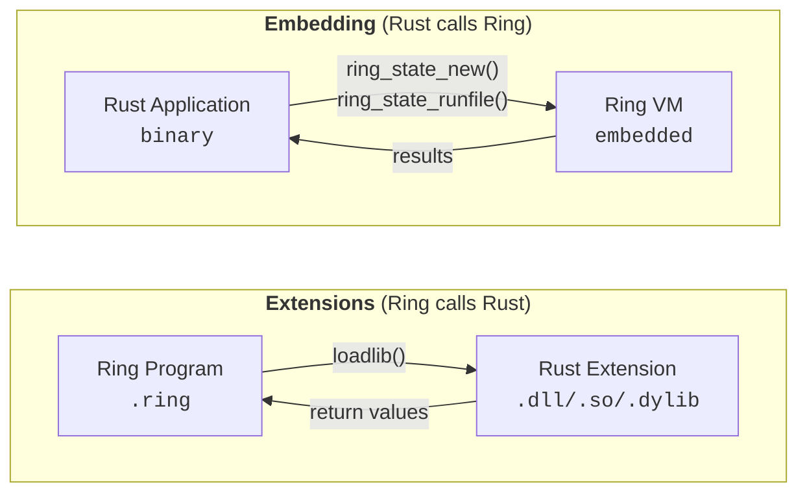

# ring-lang-rs

Rust bindings for the [Ring programming language](https://ring-lang.github.io/).

## Use Cases

1. **Write Ring extensions in Rust** - Create native extensions with Rust's safety and performance
2. **Embed Ring in Rust applications** - Run Ring scripts from your Rust programs
3. **Wrap Rust crates for Ring** - Expose any Rust library to Ring applications

## How It Works



---

## Using Extensions

If you have a Rust extension (`.dll`/`.so`/`.dylib`), using it is simple:

```ring
# Load the library (OS-specific)
if iswindows()
    loadlib("myextension.dll")
elseif ismacosx()
    loadlib("libmyextension.dylib")
else
    loadlib("libmyextension.so")
ok

# Call functions just like native Ring functions
? rust_hello()           # Hello from Rust!
? rust_add(10, 20)       # 30
? rust_greet("Ring")     # Hello, Ring!
```

That's it! No Rust knowledge required.

---

## Creating Extensions

The rest of this document covers how to **create Ring extensions in Rust** or **embed Ring** in Rust applications.

### Supported Platforms

Linux, macOS, Windows, FreeBSD

### Requirements

- Rust (stable)
- [Ring language](https://ring-lang.github.io/) installed

### Installation

Add to your `Cargo.toml`:

```toml
[lib]
crate-type = ["cdylib"]

[dependencies]
ring-lang-rs = "0.1"
```

Or clone and use locally:

```bash
git clone https://github.com/ysdragon/ring-lang-rs
cd ring-lang-rs
cargo build --release
```

### Environment Variables

Optional: Set `RING` (or `ring`) to your Ring installation directory:

```bash
# Linux/macOS
export RING=/path/to/ring

# Windows (PowerShell)
$env:RING = "C:\path\to\ring"

# Windows (CMD)
set RING=C:\path\to\ring
```

If not set, the system's libring will be used.

### Quick Start

**Extension example:**
```bash
cd examples/basic
cargo build --release
ring test.ring
```

**Embedding example:**
```bash
cd examples/embed
cargo build --release
./target/release/embed_ring        # Linux/macOS
.\target\release\embed_ring.exe    # Windows
```

---

### Basic Function

```rust
use ring_lang_rs::*;

ring_func!(ring_hello, |p| {
    ring_check_paracount!(p, 0);
    ring_ret_string!(p, "Hello from Rust!");
});

ring_libinit! {
    b"rust_hello\0" => ring_hello,
}
```

### Working with Numbers

```rust
ring_func!(ring_add, |p| {
    ring_check_paracount!(p, 2);
    ring_check_number!(p, 1);
    ring_check_number!(p, 2);

    let a = ring_get_number!(p, 1);
    let b = ring_get_number!(p, 2);

    ring_ret_number!(p, a + b);
});
```

### Working with Strings

```rust
ring_func!(ring_greet, |p| {
    ring_check_paracount!(p, 1);
    ring_check_string!(p, 1);

    let name = ring_get_string!(p, 1);
    let greeting = format!("Hello, {}!", name);

    ring_ret_string!(p, &greeting);
});
```

### Working with Lists

```rust
ring_func!(ring_create_list, |p| {
    let list = ring_new_list!(p);
    ring_list_addint(list, 1);
    ring_list_addint(list, 2);
    ring_list_adddouble(list, 3.14);
    ring_list_addstring(list, b"hello\0");

    ring_ret_list!(p, list);
});

ring_func!(ring_sum_list, |p| {
    ring_check_paracount!(p, 1);
    ring_check_list!(p, 1);

    let list = ring_get_list!(p, 1);
    let size = ring_list_getsize(list);
    let mut sum = 0.0;

    for i in 1..=size {
        if ring_list_isnumber(list, i) {
            sum += ring_list_getdouble(list, i);
        }
    }

    ring_ret_number!(p, sum);
});
```

### Working with C Pointers (Rust Structs)

```rust
use std::ffi::c_void;

const MY_TYPE: &[u8] = b"MyStruct\0";

struct MyStruct {
    value: i32,
}

ring_func!(ring_create_struct, |p| {
    let my_struct = Box::new(MyStruct { value: 42 });
    let ptr = Box::into_raw(my_struct);

    ring_ret_cpointer!(p, ptr, MY_TYPE);
});

ring_func!(ring_get_value, |p| {
    ring_check_paracount!(p, 1);
    ring_check_cpointer!(p, 1);

    if let Some(s) = ring_get_pointer!(p, 1, MyStruct, MY_TYPE) {
        ring_ret_number!(p, s.value);
    } else {
        ring_error!(p, "Invalid pointer");
    }
});
```

### Managed Pointers (Auto-freed by Ring GC)

```rust
extern "C" fn free_my_struct(_state: *mut c_void, ptr: *mut c_void) {
    if !ptr.is_null() {
        unsafe { let _ = Box::from_raw(ptr as *mut MyStruct); }
    }
}

ring_func!(ring_create_managed, |p| {
    let my_struct = Box::new(MyStruct { value: 42 });
    let ptr = Box::into_raw(my_struct);

    ring_ret_managed_cpointer!(p, ptr, MY_TYPE, free_my_struct);
});
```

### Available Macros

| Macro | Description |
|-------|-------------|
| `ring_libinit!` | Register functions with Ring |
| `ring_func!` | Define a Ring function with boilerplate |
| `ring_check_paracount!` | Validate parameter count |
| `ring_check_paracount_range!` | Validate parameter count within range |
| `ring_check_string!` | Validate string parameter |
| `ring_check_number!` | Validate number parameter |
| `ring_check_list!` | Validate list parameter |
| `ring_check_pointer!` | Validate pointer parameter |
| `ring_check_cpointer!` | Validate C pointer parameter |
| `ring_get_string!` | Get string parameter |
| `ring_get_number!` | Get number parameter (f64) |
| `ring_get_int!` | Get integer parameter (i32) |
| `ring_get_list!` | Get list parameter |
| `ring_get_pointer!` | Get typed pointer as `Option<&mut T>` |
| `ring_get_cpointer!` | Get raw C pointer |
| `ring_new_list!` | Create new list |
| `ring_ret_number!` | Return number |
| `ring_ret_string!` | Return string |
| `ring_ret_list!` | Return list |
| `ring_ret_cpointer!` | Return C pointer |
| `ring_ret_managed_cpointer!` | Return managed C pointer |
| `ring_error!` | Raise Ring error |

### Module Structure

| Module | Description |
|--------|-------------|
| `ffi` | Raw FFI bindings + struct definitions (VM, List, Item, String) |
| `api` | Ring VM API wrappers (58 functions) |
| `list` | List manipulation (66 functions) |
| `string` | String operations (15 functions) |
| `state` | State management (31 functions) |
| `vm` | VM control and execution (44 functions) |
| `item` | Item/value operations (23 functions) |
| `general` | File/directory utilities (14 functions) |
| `macros` | Ergonomic helper macros |

### API Coverage

**192 / 456 functions (42%)** of Ring's public C API.

| Header | Coverage |
|--------|----------|
| `vm.h` | 29/29 (100%) |
| `state.h` | 19/20 (95%) |
| `rstring.h` | 11/22 (50%) |
| `ritem.h` | 17/34 (50%) |
| `general.h` | 12/28 (43%) |
| `rlist.h` | 54/131 (41%) |
| `ringapi.h` | 39/111 (35%) |
| `vmgc.h` | 4/81 (5%) |

We focused on functions useful for writing extensions. `ringapi.h` has many type-check macros (bound separately). `rlist.h` and `vmgc.h` have `_gc` variants we skip.

---

## Embedding Ring

To embed Ring in a Rust application:

**Cargo.toml:**
```toml
[dependencies]
ring-lang-rs = "0.1"
```

### Running Code

```rust
use ring_lang_rs::*;

fn main() {
    // Run code from string (VM must be initialized)
    let state = ring_state_init();
    ring_state_runcode_str(state, r#"? "Hello from Ring!""#);
    ring_state_delete(state);

    // Run code from file (compiles from scratch)
    let state = ring_state_new();
    ring_state_runfile_str(state, "script.ring");
    ring_state_delete(state);
}
```

### Sharing Variables

```rust
use ring_lang_rs::*;

fn main() {
    let state = ring_state_init();

    // Rust -> Ring: Pass data via runcode
    let value = 42.5;
    ring_state_runcode_str(state, &format!("x = {}", value));

    // Ring computes
    ring_state_runcode_str(state, "result = x * 2");

    // Ring -> Rust: Read variable back
    let var = ring_state_findvar_str(state, "result");
    if !var.is_null() {
        let result = ring_list_getdouble(var, RING_VAR_VALUE);
        println!("result = {}", result); // 85
    }

    ring_state_delete(state);
}
```

### API Reference

| Function | Requires | Description |
|----------|----------|-------------|
| `ring_state_init()` | - | Create state with initialized VM |
| `ring_state_new()` | - | Create state for compilation |
| `ring_state_runcode_str()` | `ring_state_init()` | Execute code on initialized VM |
| `ring_state_runfile_str()` | `ring_state_new()` | Compile and run a file |
| `ring_state_runstring_str()` | `ring_state_new()` | Compile and run a string |
| `ring_state_findvar_str()` | `ring_state_init()` | Find a variable by name |
| `ring_state_delete()` | - | Clean up and free the state |

See `examples/embed/` for a complete working example.

## License

This project is licensed under the MIT License - see the [LICENSE](LICENSE) file for details.
